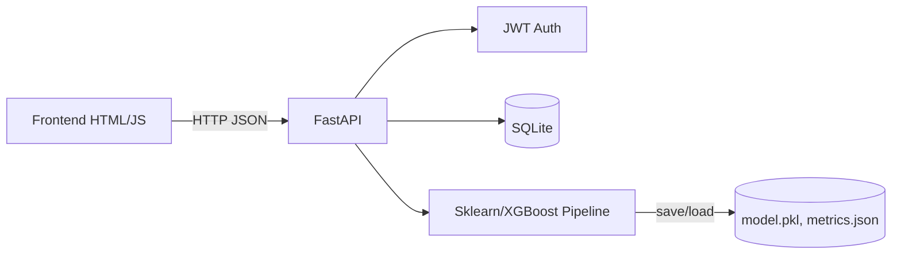

# 🎓 Student Performance Prediction (FastAPI + ML)

## Overview
- **Backend**: FastAPI with JWT auth, SQLite logging, ML pipeline (LogReg, RandomForest, optional XGBoost).
- **Frontend**: HTML + Tailwind + Chart.js (Home, Predict, Charts).
- **Endpoints**: `/auth/register`, `/auth/login`, `/predict`, `/train`, `/metrics`, `/bulk_predict`, `/report`.

## Setup
```bash
# 1) Create venv (Windows PowerShell)
python -m venv .venv
. .venv/Scripts/Activate.ps1

# 2) Install deps
pip install -r requirements.txt

# 3) Run API
uvicorn backend.main:app --reload
```

Open `frontend/index.html` in your browser.

## Usage Flow
- **Register** a user on Home page, then **Login** to get token.
- Click **Train** to train and save the best model; metrics are updated.
- Go to **Predict** to submit features and get Pass/Fail with probabilities.
- **Charts** page visualizes metrics with Chart.js.
- Use **/bulk_predict** with a CSV containing columns: `study_hours,attendance,previous_marks,participation,internet_access,parental_education`.

## Data
- The app auto-generates a synthetic dataset at `backend/data/students_sample.csv` if none is found.
- To use UCI dataset, place a cleaned CSV at that path with the same columns plus `passed` target (0/1).

## Database
- SQLite file `app.db` is created automatically.
- Tables: `users`, `predictions`.

## Security
- JWT with HS256. Change `SECRET_KEY` in `backend/auth.py` for production.

## Research References (Suggested)
- Y. K. Mehta et al., "Student performance prediction using ML..." IEEE/Springer examples. Summarize 3–5 papers here.

## Architecture


## API
- `POST /auth/register?username=&password=`
- `POST /auth/login` (form-encoded: `username`, `password`) -> `{access_token}`
- `POST /train` (auth)
- `GET /metrics`
- `POST /predict` (auth) JSON body with features
- `POST /bulk_predict` (auth, multipart CSV file)
- `GET /report` (auth) `?format=csv|json`

## Notes
- If `xgboost` isn't available, the pipeline uses LogReg/RF automatically.
- Tailwind/Chart.js are loaded via CDN for simplicity.
